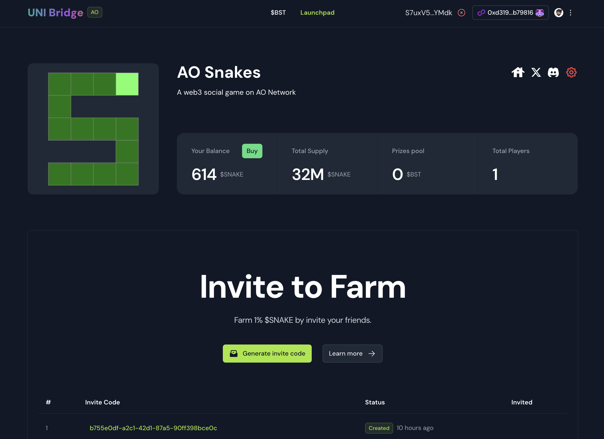
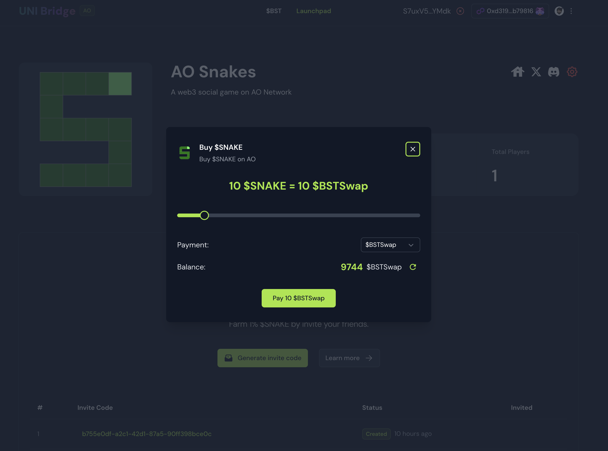
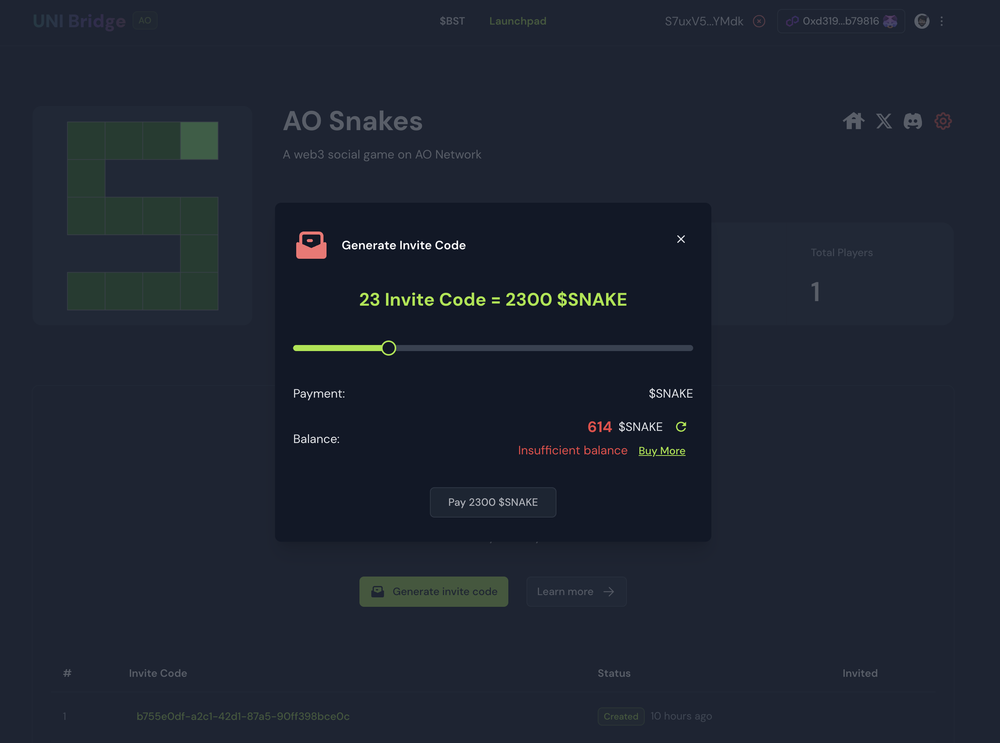

# AO-App-GTM-SaaS

AO App go-to-market SaaS

## Links

- [AO-Snake](https://ao-snake.rwa-wallet.com)
- [uni-bridge](https://ub.rwa-wallet.com)
- [PDF Deck](./ao-app-gtm-saas.pdf)
- [Video Demo](https://www.loom.com/share/65cfebf614184058b968b163c5561780)

_We do not share the frontend code here as we are not ready to open-source it._

## Features

New AO Apps / Games can use this SaaS to:

- launch their tokens
- have a invite to earn program in seconds
- help their potential users to buy their assets via ethereum

Also we create a ao/lua code pattern in out examples

## Reasons for this project

As I have been all in web3 for two years now, I have been building over 20+ PoC, and launch 5 MVPs.

But still lack of a good web3 Go-To-Market SaaS for my ideas.

Also I build the ao-snake game, and I realized that the game need to keep with marketing and business in mind.

Why not just build one Go-To-Market SaaS by myself?

That is how the LaunchPad was born in the [uni-bridge](https://ub.rwa-wallet.com)

This platform I have been integrated with SwapKit and wormhole SDK that can bridge hundreds of tokens to any chains.

And I am working on add ao support for it, so it will open the gate for the assets to run into ao world.

## How the LaunchPad works

We use [AO-Snake](https://ao-snake.rwa-wallet.com) as an example to show how the LaunchPad works.
Here AO-Snake game is the third party game vendor.

1. Vendor create a new project on the launchpad
2. Vendor setup the project with the token information, and the business logic for the invite to earn program

## The AO lua code pattern

Every AO Lua contract has the following code pattern:

- Info: the contract's basic informations
- States: the contract's states
- Methods: the contract's methods
- UserActions: the contract's user actions
- ContractActions: the contract's contract actions

we use one handler `router` to handle the user actions and contract actions

```lua
Handlers.add(
  "router",
  function(msg)
    Helper.log('snake:router', msg, {
      From = msg.From,
      UserAction = msg.UserAction,
      ContractAction = msg.ContractAction,
      Tags = msg.Tags
    })
    local noUserAction = msg.UserAction == nil or UserActions[msg.UserAction] == nil
    local noContractAction = msg.ContractAction == nil or ContractActions[msg.ContractAction] == nil

    if (noUserAction and noContractAction) then return false end
    return true
  end,
  function(msg)
    local Data = nil

    if (msg.UserAction and UserActions[msg.UserAction]) then
      Data = UserActions[msg.UserAction](msg)
    elseif (msg.ContractAction and ContractActions[msg.ContractAction]) then
      Data = ContractActions[msg.ContractAction](msg)
    end
    if (Data == nil) then
      Data = ''
    end
    if (type(Data) ~= "table") then
      Data = {
        value = tostring(Data)
      }
    end

    msg.reply({
      Data = Data,
    })
  end
)
```

### user actions

the actions that user can call from the outside of the contract, usually call from Dapp.

### contract actions

the actions that contract can call from other contracts, each contract action method need to verify the permission of the caller, in our ao-snake example, only the paymentList contract address can call the buy action.

In the beginning of the `ContractActions.buy`, you can see the permission check:

```lua
local payment = msg.From
if States.paymentList[payment] ~= true then
return {
    error = "payment not in list"
}
end
```

### ending

at the end of each ao lua contract, we have a `return` statement

```lua
return {
  Info = Info,
  States = States,
  Methods = Methods,
  UserActions = UserActions,
  ContractActions = ContractActions,
}
```

### Conclusion

I hope this pattern can help developers to build their ao lua contract in a unified way, so they can focus on their business logic. And other developers can review the code easily.

## Screenshot

### Launchpad overview



### Buy app token



### Buy invite code


